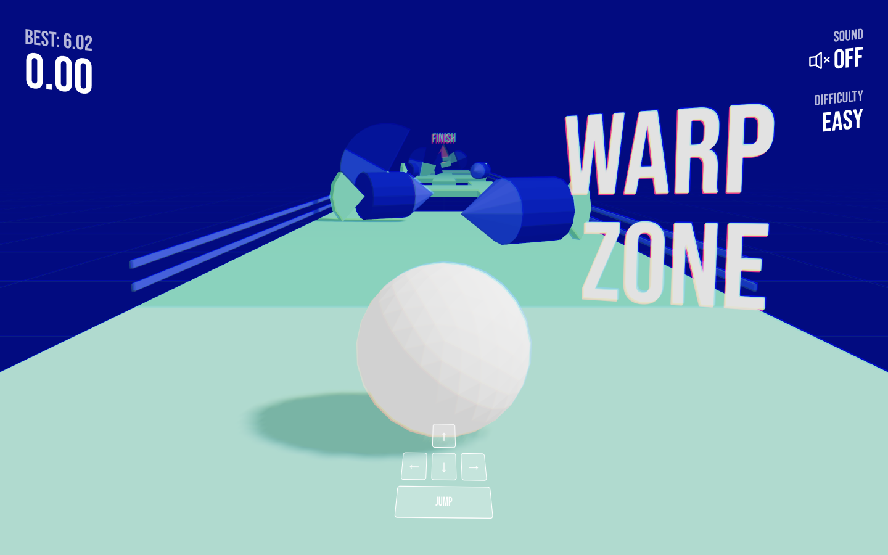

# Bleech Challenge

Marble race game made with R3F. It's inspired by the last lesson of the [Three.js Journey](https://threejs-journey.com/lessons/create-a-game-with-r3f) course.

**[Play Game](https://madflip.github.io/bleech-challenge/)**





To run the project, execute the following commands:

``` bash
# Install dependencies (only the first time)
npm install

# Run the local server at localhost:8080
npm run dev

# Build for production in the dist/ directory
npm run build
```
